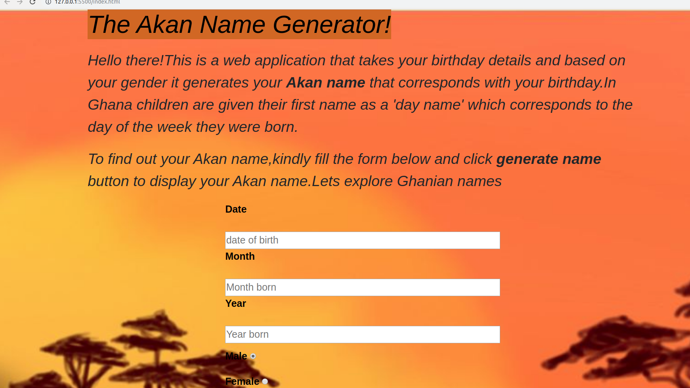

# Akan Name Generator

## project description

The Akan name generator is an application that takes your birthday details and based on your gender it gives you an Akan name that corresponds to the day you were born.Akan names are derived from Ghanian culture.

## Author

Mary Angenyi Nyaboke

## Features

Here are the features of the application:

- Input of year of birth.
- Input month of birth.
- Input date of birth.
- select your gender.
- output Akan name.

## Set-up instructions

- To get the application login to git hub and search MaryAngenyi/akan-names.
  -Enter your date of birth.
- Enter month of birth .
- Enter year of birth.
- Then click the submit button to get your Akan name.

## Technology used

The technology used to develop the the application include:

- HTML
- CSS
- Javascript

## Contacts details

You are feel to provide any form of feedback,for any feedback call 0734534556 or email maryangenyi098@gmail.com

## BDD

When you have entered your birthday details your akan name will pop on your screen.

## License and Copyright information

Copyright (c) 2019 Justusm10moringaschool
Permission is hereby granted, free of charge, to any person obtaining a copy
of this software and associated documentation files (the "Software"), to deal
in the Software without restriction, including without limitation the rights
to use, copy, modify, merge, publish, distribute, sublicense, and/or sell
copies of the Software, and to permit persons to whom the Software is
furnished to do so, subject to the following conditions:
The above copyright notice and this permission notice shall be included in all
copies or substantial portions of the Software.
THE SOFTWARE IS PROVIDED "AS IS", WITHOUT WARRANTY OF ANY KIND, EXPRESS OR
IMPLIED, INCLUDING BUT NOT LIMITED TO THE WARRANTIES OF MERCHANTABILITY,
FITNESS FOR A PARTICULAR PURPOSE AND NONINFRINGEMENT. IN NO EVENT SHALL THE
AUTHORS OR COPYRIGHT HOLDERS BE LIABLE FOR ANY CLAIM, DAMAGES OR OTHER
LIABILITY, WHETHER IN AN ACTION OF CONTRACT, TORT OR OTHERWISE, ARISING FROM,
OUT OF OR IN CONNECTION WITH THE SOFTWARE OR THE USE OR OTHER DEALINGS IN THE
SOFTWARE.
